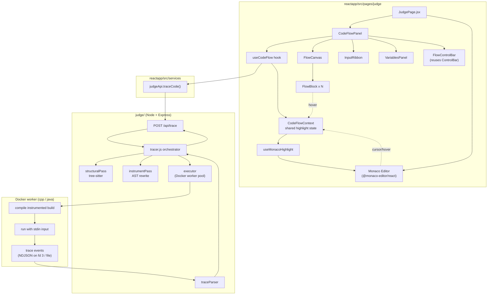
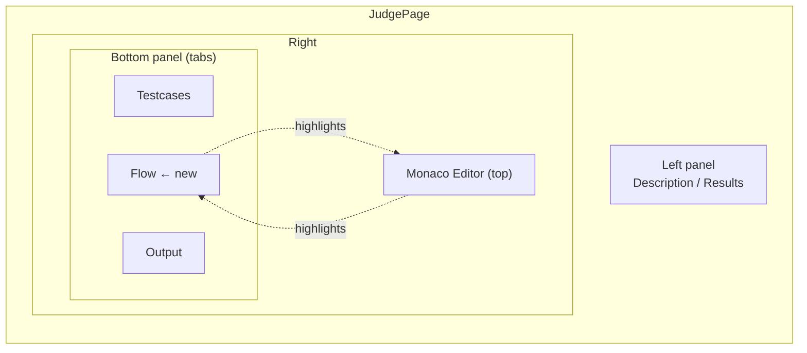
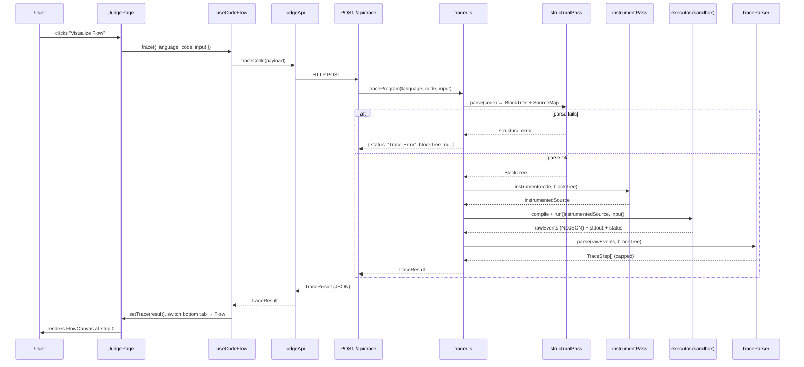
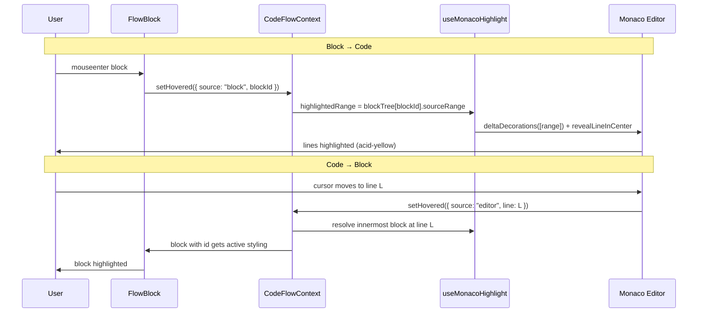

# Design Document: Code Flow Visualizer

## Overview

The Code Flow Visualizer is a new feature on the Vantage coding page (`reactapp/src/pages/judge/JudgePage.jsx`) that lets a user, after running their code, see an interactive visual representation of how their program executed. Source constructs (function bodies, loops, conditionals, variable declarations, function calls, and I/O reads/writes) are rendered as nested **visual blocks**. Hovering a block highlights the exact source snippet it represents in the Monaco editor, and hovering a line in the editor highlights the block — a bidirectional mapping. The panel also visualizes the **inputs forwarded** into the program and how they are consumed, and supports stepping/playback through the recorded execution trace.

Because the supported languages (C++ and Java) are compiled, runtime flow cannot be captured the way it can for an interpreted language running in the browser. This design captures flow on the **judge backend** (`judge/`) through a two-pass pipeline: a **static structural pass** (parse the source into a block tree with precise source ranges) and a **dynamic trace pass** (run an instrumented build that emits structured per-statement events). The frontend consumes a single `TraceResult` payload and renders it, reusing the existing visualizer design tokens (`components/visualizer/theme.js`) and playback control patterns (`ControlBar`) to stay consistent with the Terminal Brutalism aesthetic.

This document covers both the high-level design (architecture, sequence flows, component interfaces, data models) and the low-level design (algorithmic pseudocode with formal specifications for the tracer pipeline and the bidirectional highlight engine).

---

## Architecture



**Key architectural decisions:**

1. **Trace capture happens on the backend**, not in the browser, because C++/Java execution already lives in the judge's Docker sandboxes. The frontend stays a pure renderer of a serialized `TraceResult`.
2. **Two passes, separated**: a static pass builds the block tree + source map (works even if the program crashes), and a dynamic pass records the actual execution path and variable values. Static-only results still render a (non-animated) block view, so the feature degrades gracefully.
3. **New isolated endpoint `/api/trace`** rather than overloading `/api/run`. Tracing is heavier (instrumentation + larger payload) and should not affect the latency of the normal Run/Submit paths.
4. **Reuse, don't rebuild**: the frontend reuses `theme.js` tokens, `ControlBar` playback semantics, and `CodePanel` highlighting concepts. Monaco's native decoration API powers the editor-side highlight.

### Integration point in JudgePage

The flow view is added as a **third tab in the existing bottom panel** (`Testcases | Output | Flow`), so the Monaco editor remains visible directly above it. Hovering a block in the Flow tab highlights lines in the editor above it, which is the natural layout for the bidirectional hover requirement. A "Visualize Flow" affordance appears next to the existing Run/Submit buttons; running it triggers a trace and switches the bottom tab to `Flow`.



---

## Sequence Diagrams

### Main flow: user visualizes execution



### Bidirectional hover highlight



---

## Components and Interfaces

### Backend Component: `tracer.js`

**Purpose**: Orchestrates the trace pipeline: static parse → instrument → compile/run → parse events → assemble `TraceResult`. Lives in `judge/src/tracer.js`.

**Interface**:
```typescript
// All cross-boundary payloads are plain JSON-serializable objects.

interface TraceRequest {
  language: "cpp" | "java";
  code: string;
  input: string;       // stdin forwarded to the program
}

interface TraceResult {
  status: TraceStatus;
  language: "cpp" | "java";
  blockTree: BlockNode | null;   // root block (program); null if parse failed
  steps: TraceStep[];            // ordered execution events (possibly capped)
  inputTokens: InputToken[];     // tokenized stdin for the InputRibbon
  stdout: string;                // program output
  meta: TraceMeta;
  error?: string;                // human-readable message when status != "OK"
}

type TraceStatus =
  | "OK"                 // full static + dynamic trace
  | "StaticOnly"         // block tree built, but run failed (still renders blocks)
  | "Compilation Error"
  | "Runtime Error"
  | "Time Limit Exceeded"
  | "Trace Error";       // parsing/instrumentation failed

interface TraceMeta {
  totalSteps: number;    // events emitted before capping
  truncated: boolean;    // true if steps were capped
  stepCap: number;       // the cap applied (e.g. 10000)
  timeMs: number;        // wall-clock execution time
}

async function traceProgram(req: TraceRequest): Promise<TraceResult>;
```

**Responsibilities**:
- Validate input sizes (reuse limits from `submission.js`: 64 KB code, 1 MB input).
- Build the block tree via `structuralPass`; on failure return `Trace Error`.
- Instrument and execute; on compile/runtime failure return `StaticOnly` with the block tree so the UI still works.
- Cap and assemble steps, then return a single `TraceResult`.

### Backend Component: `structuralPass`

**Purpose**: Parse source into a `BlockNode` tree with precise source ranges, using Tree-sitter grammars (`tree-sitter-cpp`, `tree-sitter-java`). Lives in `judge/src/trace/structuralPass.js`.

**Interface**:
```typescript
interface StructuralResult {
  blockTree: BlockNode;
  sourceMap: SourceMap;   // line → blockId[] (innermost last)
}

function buildBlockTree(language: "cpp" | "java", code: string): StructuralResult;
```

**Responsibilities**:
- Walk the concrete syntax tree, mapping grammar node types to `BlockType`.
- Assign each block a stable `id` and a `sourceRange` (1-based start/end line + column).
- Produce a `SourceMap` for fast line → block resolution used by the editor → block direction.

### Backend Component: `instrumentPass`

**Purpose**: Rewrite the source so each tracked statement emits a structured event at runtime. Lives in `judge/src/trace/instrumentPass.js`.

**Interface**:
```typescript
interface InstrumentResult {
  source: string;        // instrumented, compilable source
  probeCount: number;    // number of injected probes (for sanity checks)
}

function instrument(
  language: "cpp" | "java",
  code: string,
  blockTree: BlockNode
): InstrumentResult;
```

**Responsibilities**:
- Inject a trace emitter helper (writes NDJSON to file descriptor 3 / a trace file, never stdout, so program output stays clean).
- At each block boundary and assignment, emit `{ blockId, line, kind, vars }`.
- Guard the emitter with a global event counter that hard-stops after `stepCap` events to bound output and runtime.

### Frontend Component: `CodeFlowPanel`

**Purpose**: Container rendered inside the `Flow` bottom tab. Owns layout and wires the hook, canvas, ribbon, variables, and controls. Lives in `reactapp/src/pages/judge/codeflow/CodeFlowPanel.jsx`.

**Interface**:
```typescript
interface CodeFlowPanelProps {
  language: "cpp" | "java";
  code: string;
  input: string;
  editorRef: React.RefObject<MonacoEditor>;  // shared from JudgePage
  active: boolean;                             // is the Flow tab currently visible
}
```

**Responsibilities**:
- Call `useCodeFlow` to fetch/hold the trace and current step.
- Provide `CodeFlowContext` so blocks and the Monaco highlighter share hover state.
- Render `FlowControlBar`, `FlowCanvas`, `InputRibbon`, `VariablesPanel`, and idle/error/loading states.

### Frontend Component: `FlowCanvas` + `FlowBlock`

**Purpose**: Render the `BlockNode` tree as nested visual blocks; highlight blocks that are active at the current step; emit hover events. Lives in `reactapp/src/pages/judge/codeflow/FlowCanvas.jsx` and `FlowBlock.jsx`.

**Interface**:
```typescript
interface FlowCanvasProps {
  blockTree: BlockNode;
  activeBlockIds: Set<string>;   // blocks active at current step
  currentStep: TraceStep | null;
}

interface FlowBlockProps {
  node: BlockNode;
  activeBlockIds: Set<string>;
  depth: number;
}
```

**Responsibilities**:
- Recursively render `node.children`, indenting by `depth`.
- Style by `BlockType` (loop, conditional, declaration, call, io, function, return).
- On `mouseenter`/`mouseleave`, update `CodeFlowContext.hovered`.
- Show iteration counts for loop blocks from the current step context.

### Frontend Component: `useMonacoHighlight`

**Purpose**: Translate the shared highlight state into Monaco editor decorations and reveal calls. Lives in `reactapp/src/pages/judge/codeflow/useMonacoHighlight.js`.

**Interface**:
```typescript
function useMonacoHighlight(
  editorRef: React.RefObject<MonacoEditor>,
  highlightedRange: SourceRange | null,
  activeRange: SourceRange | null   // current-step execution line
): void;
```

**Responsibilities**:
- Maintain a decorations collection; apply a `hover-highlight` class for hovered blocks and an `exec-highlight` class for the current step's line.
- `revealLineInCenter` for the active execution line during playback.
- Clean up decorations on unmount and when ranges clear.

---

## Data Models

### Model: `BlockNode`

```typescript
type BlockType =
  | "program"      // root
  | "function"     // function / method body
  | "loop"         // for / while / do-while / for-each
  | "conditional"  // if / else-if / else / switch
  | "declaration"  // variable declaration
  | "assignment"   // re-assignment to existing variable
  | "call"         // function/method call statement
  | "io"           // input read or output write (cin/cout, Scanner/System.out)
  | "return"       // return statement
  | "block";       // generic compound statement

interface SourceRange {
  startLine: number;   // 1-based, inclusive
  startCol: number;    // 1-based
  endLine: number;     // 1-based, inclusive
  endCol: number;      // 1-based
}

interface BlockNode {
  id: string;              // stable, e.g. "b12"
  type: BlockType;
  label: string;           // short human label, e.g. "for (i = 0; i < n; i++)"
  sourceRange: SourceRange;
  parentId: string | null;
  children: BlockNode[];
}
```

**Validation Rules**:
- `id` is unique across the tree.
- `sourceRange.startLine <= sourceRange.endLine`.
- A child's `sourceRange` is contained within its parent's `sourceRange`.
- Exactly one node has `type === "program"` and `parentId === null`.

### Model: `TraceStep`

```typescript
type StepKind =
  | "enter"     // entered a block
  | "exit"      // left a block
  | "iterate"   // a new loop iteration began
  | "assign"    // a variable was declared/assigned
  | "read"      // input consumed from stdin
  | "write"     // output produced to stdout
  | "call"      // a function call was made
  | "return";   // a function returned

interface VarSnapshot {
  name: string;
  type: string;        // best-effort, e.g. "int", "String", "vector<int>"
  value: string;       // stringified value (arrays/objects summarized)
  scope: string;       // owning blockId or function name
  changed: boolean;    // changed vs the previous step
}

interface TraceStep {
  index: number;          // 0-based ordinal in steps[]
  blockId: string;        // block this step belongs to
  line: number;           // 1-based source line executing
  kind: StepKind;
  vars: VarSnapshot[];    // visible variables after this step
  iteration?: number;     // 1-based loop iteration (for loop blocks)
  stdoutDelta?: string;   // text written to stdout at this step
  inputConsumed?: string; // token(s) read from stdin at this step
}
```

**Validation Rules**:
- `index` values are contiguous starting at 0.
- `blockId` references an existing `BlockNode.id`.
- `line` lies within the referenced block's `sourceRange`.
- `iteration` is present only when the block is a `loop`.

### Model: `InputToken` and `SourceMap`

```typescript
interface InputToken {
  index: number;        // position in the input stream
  raw: string;          // the token text
  consumedAtStep: number | null;  // step index that read it, or null if unused
}

// Fast line → block lookup for the editor → block direction.
// Each line maps to the chain of blocks covering it, innermost last.
type SourceMap = Record<number, string[]>;  // line → blockId[]
```

**Validation Rules**:
- `InputToken.index` is contiguous from 0.
- Every `blockId` in `SourceMap` references an existing `BlockNode`.
- For each line key, the listed blocks are ordered outermost → innermost.

---

## Algorithmic Pseudocode

This section gives the formal algorithms for the trace pipeline (backend) and the bidirectional highlight resolution (frontend).

### Algorithm 1: Orchestrate trace (`traceProgram`)

```pascal
ALGORITHM traceProgram(language, code, input)
INPUT:  language ∈ {"cpp","java"}, code: String, input: String
OUTPUT: result of type TraceResult

BEGIN
  ASSERT language IN {"cpp","java"}
  ASSERT length(code) <= MAX_CODE_SIZE AND length(input) <= MAX_INPUT_SIZE

  // ── Static pass (always attempted) ──
  TRY
    structural ← buildBlockTree(language, code)
  CATCH parseError
    RETURN { status: "Trace Error", blockTree: NULL, steps: [],
             inputTokens: tokenizeInput(input), stdout: "",
             meta: emptyMeta(), error: parseError.message }
  END TRY

  blockTree ← structural.blockTree

  // ── Instrument ──
  TRY
    instrumented ← instrument(language, code, blockTree)
  CATCH instrumentError
    // fall back to a non-animated block view
    RETURN { status: "StaticOnly", blockTree: blockTree, steps: [],
             inputTokens: tokenizeInput(input), stdout: "",
             meta: emptyMeta(), error: instrumentError.message }
  END TRY

  // ── Dynamic pass (compile + run instrumented build in sandbox) ──
  run ← executeInstrumented(language, instrumented.source, input)

  IF run.compilationError THEN
    RETURN { status: "StaticOnly", blockTree: blockTree, steps: [],
             inputTokens: tokenizeInput(input), stdout: "",
             meta: emptyMeta(), error: run.stderr }
  END IF

  // ── Parse emitted events into capped steps ──
  parsed ← parseTraceEvents(run.traceEvents, blockTree, STEP_CAP)

  status ← "OK"
  IF run.tle THEN status ← "Time Limit Exceeded"
  ELSE IF run.exitCode ≠ 0 THEN status ← "Runtime Error"

  inputTokens ← linkConsumedTokens(tokenizeInput(input), parsed.steps)

  RETURN {
    status: status,
    language: language,
    blockTree: blockTree,
    steps: parsed.steps,
    inputTokens: inputTokens,
    stdout: run.stdout,
    meta: { totalSteps: parsed.totalSteps,
            truncated: parsed.totalSteps > STEP_CAP,
            stepCap: STEP_CAP, timeMs: run.time },
    error: (status = "Runtime Error") ? run.stderr : NULL
  }
END
```

**Preconditions:**
- `language` is supported; `code` and `input` are within size limits.
- A Docker worker (or host toolchain) is available via the existing executor.

**Postconditions:**
- Always returns a `TraceResult`; never throws to the route handler.
- `status = "OK"` ⟹ `blockTree ≠ NULL` ∧ `steps` is a valid, contiguous sequence.
- `status = "StaticOnly"` ⟹ `blockTree ≠ NULL` ∧ `steps = []`.
- `status = "Trace Error"` ⟹ `blockTree = NULL`.
- `length(steps) ≤ STEP_CAP`.

**Loop Invariants:** N/A (no explicit loop; delegates to sub-algorithms).

### Algorithm 2: Build block tree (`buildBlockTree`)

```pascal
ALGORITHM buildBlockTree(language, code)
INPUT:  language, code
OUTPUT: StructuralResult { blockTree, sourceMap }

BEGIN
  cst ← TreeSitter.parse(language, code)   // concrete syntax tree
  IF cst.hasError AND cst.rootCoversNothing THEN
    THROW ParseError("Unable to parse source")
  END IF

  idCounter ← 0
  sourceMap ← empty map

  // Recursive descent producing BlockNodes for "interesting" cst nodes
  FUNCTION visit(cstNode, parentId)
    type ← mapGrammarType(language, cstNode.grammarType)  // may be NULL (skip)

    IF type = NULL THEN
      // not a block boundary itself; still recurse to find nested blocks
      childBlocks ← []
      FOR each child IN cstNode.namedChildren DO
        childBlocks.appendAll(visit(child, parentId))
      END FOR
      RETURN childBlocks
    END IF

    idCounter ← idCounter + 1
    node ← {
      id: "b" + idCounter,
      type: type,
      label: makeLabel(type, cstNode, code),
      sourceRange: rangeOf(cstNode),       // 1-based lines/cols
      parentId: parentId,
      children: []
    }

    // register every covered line → this block (outer pushed before inner)
    FOR ln FROM node.sourceRange.startLine TO node.sourceRange.endLine DO
      sourceMap[ln] ← append(sourceMap[ln] OR [], node.id)
    END FOR

    FOR each child IN cstNode.namedChildren DO
      node.children.appendAll(visit(child, node.id))
    END FOR

    RETURN [node]
  END FUNCTION

  roots ← visit(cst.rootNode, NULL)
  program ← {
    id: "b0", type: "program", label: "program",
    sourceRange: rangeOf(cst.rootNode), parentId: NULL, children: roots
  }
  // ensure program covers all lines in sourceMap as outermost
  prependProgramToSourceMap(sourceMap, "b0")

  RETURN { blockTree: program, sourceMap: sourceMap }
END
```

**Preconditions:**
- `code` is a string in the given language; a Tree-sitter grammar exists for `language`.

**Postconditions:**
- Returns a tree rooted at a single `program` node (`parentId = NULL`).
- For every `BlockNode b` (except root), `b.sourceRange ⊆ parent(b).sourceRange`.
- For every line `ln` in `sourceMap`, the list is ordered outermost → innermost.
- All `id`s are unique.

**Loop Invariants:**
- In the line-registration loop, every line in `[startLine, node.startLine-1]` already registered has `node.id` not yet appended; after iteration `ln`, `sourceMap[ln]` ends with `node.id` and preserves outer-before-inner ordering.

### Algorithm 3: Parse trace events into steps (`parseTraceEvents`)

```pascal
ALGORITHM parseTraceEvents(rawEvents, blockTree, stepCap)
INPUT:  rawEvents: String (NDJSON), blockTree, stepCap: Integer
OUTPUT: { steps: TraceStep[], totalSteps: Integer }

BEGIN
  validIds ← collectIds(blockTree)     // set of all BlockNode.id
  steps ← []
  totalSteps ← 0
  loopIterCounts ← empty map           // blockId → current iteration

  FOR each line IN splitLines(rawEvents) DO
    IF isBlank(line) THEN CONTINUE
    ev ← parseJSON(line)
    IF ev = NULL OR ev.blockId NOT IN validIds THEN CONTINUE  // defensive

    totalSteps ← totalSteps + 1
    IF length(steps) >= stepCap THEN CONTINUE   // count but do not store

    IF ev.kind = "iterate" THEN
      loopIterCounts[ev.blockId] ← (loopIterCounts[ev.blockId] OR 0) + 1
    END IF

    step ← {
      index: length(steps),
      blockId: ev.blockId,
      line: ev.line,
      kind: ev.kind,
      vars: normalizeVars(ev.vars, steps),   // sets `changed` vs prev
      iteration: (ev.kind = "iterate") ? loopIterCounts[ev.blockId] : NULL,
      stdoutDelta: ev.out,
      inputConsumed: ev.in
    }
    steps.append(step)
  END FOR

  RETURN { steps: steps, totalSteps: totalSteps }
END
```

**Preconditions:**
- `rawEvents` is newline-delimited; each non-blank line is intended to be JSON.
- `blockTree` is the tree produced by `buildBlockTree` for the same source.

**Postconditions:**
- `length(steps) = min(totalSteps, stepCap)`.
- `steps[i].index = i` for all `i` (contiguous, 0-based).
- Every `steps[i].blockId ∈ validIds` (malformed/unknown events dropped).
- `totalSteps ≥ length(steps)`; `truncated` is derivable as `totalSteps > stepCap`.

**Loop Invariants:**
- `length(steps) = min(totalSteps, stepCap)` holds after each processed event.
- `loopIterCounts[b]` equals the number of `"iterate"` events seen so far for block `b`.
- For every stored step `s`, `s.index` equals its position in `steps`.

### Algorithm 4: Resolve block from editor line (`resolveBlockAtLine`)

This powers the editor → block direction of the bidirectional highlight.

```pascal
ALGORITHM resolveBlockAtLine(sourceMap, line)
INPUT:  sourceMap: Map<Integer, String[]>, line: Integer
OUTPUT: blockId: String OR NULL

BEGIN
  chain ← sourceMap[line]
  IF chain = NULL OR isEmpty(chain) THEN
    RETURN NULL
  END IF
  // innermost block covering the line is the last element
  RETURN chain[length(chain) - 1]
END
```

**Preconditions:** `sourceMap` is the map from `buildBlockTree`; `line` is 1-based.

**Postconditions:**
- Returns the innermost `blockId` covering `line`, or `NULL` if no block covers it.
- The returned id (when non-null) references an existing `BlockNode`.

**Loop Invariants:** N/A (constant-time lookup).

### Algorithm 5: Compute active blocks for a step (`activeBlockIds`)

This powers the block → highlight-on-step direction during playback.

```pascal
ALGORITHM activeBlockIds(blockTree, step)
INPUT:  blockTree, step: TraceStep OR NULL
OUTPUT: Set<String>  // ids of the active block and all its ancestors

BEGIN
  IF step = NULL THEN RETURN ∅ END IF
  active ← ∅
  id ← step.blockId
  WHILE id ≠ NULL DO
    active ← active ∪ { id }
    id ← parentOf(blockTree, id)   // walk to root
  END WHILE
  RETURN active
END
```

**Preconditions:** `step.blockId` (when `step ≠ NULL`) references a node in `blockTree`.

**Postconditions:**
- Returns the set containing `step.blockId` and every ancestor up to the root, or ∅ when `step = NULL`.

**Loop Invariants:**
- At each iteration, `active` contains exactly the nodes on the path from `step.blockId` up to (and including) the current `id`.
- The walk strictly decreases depth, so it terminates at the root (`parentId = NULL`).

---

## Key Functions with Formal Specifications

### `traceCode()` (frontend service — `reactapp/src/services/judgeApi.js`)

```typescript
async function traceCode(payload: TraceRequest): Promise<TraceResult>
```

**Preconditions:**
- `payload.language ∈ {"cpp","java"}`; `payload.code` is non-empty.

**Postconditions:**
- Resolves with a parsed `TraceResult` on HTTP 200.
- Rejects with an `Error` whose message is derived from the response body on non-2xx (mirrors existing `runCode`/`submitCode` behavior).
- No mutation of `payload`.

### `useCodeFlow()` (frontend hook)

```typescript
function useCodeFlow(): {
  trace: TraceResult | null;
  status: "idle" | "loading" | "ready" | "error";
  step: number;                 // current step index
  totalSteps: number;
  playing: boolean;
  run(req: TraceRequest): Promise<void>;
  reset(): void;
  stepForward(): void;
  stepBackward(): void;
  togglePlay(): void;
  setSpeed(ms: number): void;
}
```

**Preconditions:**
- Called within a React component subscribed to `CodeFlowContext`.

**Postconditions:**
- `step ∈ [0, max(0, totalSteps - 1)]` at all times (clamped).
- `stepForward` is a no-op when `step = totalSteps - 1`; `stepBackward` a no-op when `step = 0`.
- `run` sets `status = "loading"`, then `"ready"` (or `"error"`), and resets `step = 0`.
- Auto-play advances one step per `speed` ms and stops at the last step.

**Loop Invariants (auto-play timer):**
- While `playing`, after each tick `step` increased by exactly 1 until `step = totalSteps - 1`, at which point `playing` becomes `false`.

### `useMonacoHighlight()` (frontend hook)

```typescript
function useMonacoHighlight(editorRef, highlightedRange, activeRange): void
```

**Preconditions:**
- `editorRef.current` is a mounted Monaco editor (or `null`, in which case the hook is inert).
- Ranges, when present, are valid 1-based `SourceRange`s within the document.

**Postconditions:**
- The editor shows at most one `hover-highlight` region (the `highlightedRange`) and at most one `exec-highlight` region (the `activeRange`).
- When both inputs are `null`, all feature-owned decorations are removed.
- Decorations are fully removed on unmount (no leaks across problem switches).

**Loop Invariants:** N/A.

---

## Example Usage

### Backend route wiring (`judge/src/routes/submission.js`)

```javascript
const { traceProgram } = require("../tracer");

// POST /api/trace — capture execution flow for visualization
router.post("/trace", async (req, res) => {
  const { language, code, input = "" } = req.body;

  if (!language || !code)
    return res.status(400).json({ error: "Missing required fields: language, code" });
  if (!["cpp", "java"].includes(language))
    return res.status(400).json({ error: "Unsupported language. Use 'cpp' or 'java'." });
  if (typeof code !== "string" || code.length > MAX_CODE_SIZE)
    return res.status(400).json({ error: `Code exceeds maximum size of ${MAX_CODE_SIZE / 1024} KB.` });
  if (typeof input !== "string" || input.length > MAX_INPUT_SIZE)
    return res.status(400).json({ error: `Input exceeds maximum size of ${MAX_INPUT_SIZE / 1024} KB.` });

  try {
    const result = await traceProgram({ language, code, input });
    return res.json(result);          // single TraceResult payload
  } catch (err) {
    console.error("Trace error:", err);
    return res.status(500).json({ error: "Internal server error during trace." });
  }
});
```

### Frontend hook usage inside `CodeFlowPanel`

```jsx
function CodeFlowPanel({ language, code, input, editorRef, active }) {
  const {
    trace, status, step, totalSteps, playing,
    run, reset, stepForward, stepBackward, togglePlay, setSpeed,
  } = useCodeFlow();

  const [hovered, setHovered] = useState(null); // { source, blockId } | { source, line }

  // Current step and the blocks active at it
  const currentStep = trace?.steps?.[step] ?? null;
  const activeIds = useMemo(
    () => (trace ? activeBlockIds(trace.blockTree, currentStep) : new Set()),
    [trace, currentStep]
  );

  // Bidirectional highlight: resolve a SourceRange from hover state
  const highlightedRange = useMemo(
    () => resolveHighlightRange(trace, hovered),
    [trace, hovered]
  );
  const activeRange = currentStep
    ? lineRange(currentStep.line)
    : null;

  useMonacoHighlight(editorRef, highlightedRange, activeRange);

  if (status === "idle")
    return <FlowIdleState onRun={() => run({ language, code, input })} />;
  if (status === "loading") return <FlowLoading />;
  if (status === "error" || !trace?.blockTree)
    return <FlowError message={trace?.error} onRetry={() => run({ language, code, input })} />;

  return (
    <CodeFlowContext.Provider value={{ hovered, setHovered, sourceMap: trace.sourceMap }}>
      <FlowControlBar
        loaded={totalSteps > 0}
        playing={playing} step={step} totalSteps={totalSteps}
        onRun={() => run({ language, code, input })}
        onReset={reset} onForward={stepForward} onBackward={stepBackward}
        onPlayPause={togglePlay} onSpeedChange={setSpeed}
      />
      <InputRibbon tokens={trace.inputTokens} currentStep={step} />
      <FlowCanvas blockTree={trace.blockTree} activeBlockIds={activeIds} currentStep={currentStep} />
      <VariablesPanel vars={currentStep?.vars ?? []} />
      {trace.status === "StaticOnly" && (
        <FlowNotice>Showing structure only — program did not run to completion.</FlowNotice>
      )}
    </CodeFlowContext.Provider>
  );
}
```

### Block → editor highlight (inside `FlowBlock`)

```jsx
function FlowBlock({ node, activeBlockIds, depth }) {
  const { setHovered } = useContext(CodeFlowContext);
  const isActive = activeBlockIds.has(node.id);

  return (
    <div
      onMouseEnter={() => setHovered({ source: "block", blockId: node.id })}
      onMouseLeave={() => setHovered(null)}
      style={{
        marginLeft: depth * 14,
        borderLeft: `2px solid ${isActive ? V.accent : V.border}`,
        background: isActive ? V.accentDim : V.surface,
        // ...BlockType-specific accent color
      }}
    >
      <BlockHeader type={node.type} label={node.label} />
      {node.children.map((child) => (
        <FlowBlock key={child.id} node={child} activeBlockIds={activeBlockIds} depth={depth + 1} />
      ))}
    </div>
  );
}
```

### Editor → block highlight (wired in JudgePage on editor mount)

```javascript
// In handleEditorMount, after editorRef.current = editor:
editor.onDidChangeCursorPosition((e) => {
  const blockId = resolveBlockAtLine(traceRef.current?.sourceMap, e.position.lineNumber);
  codeFlowCtxRef.current?.setHovered(blockId ? { source: "editor", blockId } : null);
});
```

---

## Correctness Properties

These are universal properties the implementation must satisfy. They drive the property-based tests in the Testing Strategy.

### Property 1: Containment

For every non-root `BlockNode b`, `b.sourceRange ⊆ parent(b).sourceRange`.
- ∀ b ∈ blockTree, b ≠ root ⟹ contains(parent(b).sourceRange, b.sourceRange)

**Validates: Requirements 2.3**

### Property 2: Unique IDs

All block ids are unique.
- ∀ a,b ∈ blockTree, a ≠ b ⟹ a.id ≠ b.id

**Validates: Requirements 2.2**

### Property 3: Step contiguity

Step indices are contiguous from 0.
- ∀ i ∈ [0, length(steps)), steps[i].index = i

**Validates: Requirements 3.2**

### Property 4: Referential integrity

Every step references a real block, on a line inside that block.
- ∀ s ∈ steps, s.blockId ∈ ids(blockTree) ∧ within(s.line, block(s.blockId).sourceRange)

**Validates: Requirements 3.3**

### Property 5: Step cap

The returned step count never exceeds the cap, and truncation is reported truthfully.
- length(steps) ≤ stepCap ∧ (meta.truncated ⟺ meta.totalSteps > stepCap)

**Validates: Requirements 3.4**

### Property 6: Bidirectional consistency

A block resolved from a line maps back to a range that contains that line.
- ∀ line with resolveBlockAtLine(sourceMap, line) = id ≠ NULL ⟹ within(line, block(id).sourceRange)

**Validates: Requirements 4.3**

### Property 7: Ancestor closure of active set

The active set for a step is exactly the path to root.
- activeBlockIds(tree, s) = { s.blockId } ∪ ancestors(s.blockId)

**Validates: Requirements 5.3**

### Property 8: Step clamping

The current step index is always in range.
- 0 ≤ step ≤ max(0, totalSteps - 1)

**Validates: Requirements 5.1**

### Property 9: Output purity

Trace events never pollute program stdout.
- traceResult.stdout = stdout(originalProgram, input)  // instrumentation adds nothing to stdout

**Validates: Requirements 7.2**

### Property 10: Graceful degradation

A parseable-but-failing program still yields a usable block tree.
- run fails ∧ parse succeeds ⟹ status = "StaticOnly" ∧ blockTree ≠ NULL

**Validates: Requirements 8.2**

---

## Error Handling

### Scenario 1: Source fails to parse (static pass)
**Condition**: Tree-sitter cannot produce a usable tree (e.g., severely malformed code).
**Response**: `traceProgram` returns `status: "Trace Error"`, `blockTree: null`, with `error` set.
**Recovery**: `CodeFlowPanel` renders `FlowError` with the message and a retry button; the editor and other tabs remain fully functional.

### Scenario 2: Instrumented build fails to compile
**Condition**: Instrumentation produced source the compiler rejects, or the user's code itself has a compile error.
**Response**: `status: "StaticOnly"`, `blockTree` present, `steps: []`, `error` carries compiler stderr.
**Recovery**: Render the static block tree (no playback). Show a notice that flow data is unavailable. Internally log when instrumentation is the cause (probeCount sanity check) vs. a genuine user compile error.

### Scenario 3: Program exceeds time/step limits
**Condition**: Program runs longer than the executor `TIME_LIMIT`, or emits more than `STEP_CAP` events.
**Response**: TLE → `status: "Time Limit Exceeded"` with whatever steps were captured (capped). Step overflow → `meta.truncated = true`.
**Recovery**: UI shows a "trace truncated" banner and still allows stepping through captured steps. The emitter self-terminates at `STEP_CAP` to keep payloads bounded.

### Scenario 4: Runtime error mid-execution
**Condition**: Program crashes (segfault, uncaught exception) partway through.
**Response**: `status: "Runtime Error"`, `steps` contains events up to the crash, `error` carries stderr.
**Recovery**: Playback works over captured steps; the last step approximates the crash site. The error message is surfaced in a notice.

### Scenario 5: Malformed trace events
**Condition**: A trace line is not valid JSON or references an unknown `blockId`.
**Response**: `parseTraceEvents` defensively skips the event (does not throw).
**Recovery**: Remaining valid events still produce a coherent, contiguous step list.

### Scenario 6: Editor/decoration lifecycle
**Condition**: User switches problems or unmounts the Flow tab while decorations are active.
**Response**: `useMonacoHighlight` cleanup removes all feature-owned decorations.
**Recovery**: No stale highlights leak into a new problem's editor.

---

## Testing Strategy

### Unit Testing Approach

Backend (`judge/`):
- `mapGrammarType` covers each `BlockType` for both C++ and Java grammars.
- `buildBlockTree` on fixtures (nested loops, if/else, function calls, I/O) asserts tree shape and ranges.
- `parseTraceEvents` handles: well-formed NDJSON, blank lines, malformed lines, unknown blockIds, and the step cap.
- `instrument` round-trip: instrumented C++/Java fixtures still compile and produce identical stdout to the original (output-purity check) in host mode.

Frontend (`reactapp/`):
- `resolveBlockAtLine` returns the innermost block; `null` for uncovered lines.
- `activeBlockIds` returns the exact path to root.
- `useCodeFlow` step clamping, play/pause, reset, and forward/backward edge behavior.
- `useMonacoHighlight` applies and clears decorations (Monaco mocked).

### Property-Based Testing Approach

Use property-based tests to validate the correctness properties over generated trees and event streams.

**Property Test Library**: `fast-check` (JavaScript) for both frontend and backend, matching the Node/React stack.

Generators:
- A `BlockNode`-tree generator producing valid nested ranges (parent contains children), feeding properties 1, 2, 6, 7.
- A `TraceStep[]` generator (random kinds, valid blockIds, occasional malformed events) feeding properties 3, 4, 5.
- An input-string generator feeding `tokenizeInput`/`linkConsumedTokens` (every consumed token has a valid step index).

Representative properties to encode: Containment (1), Unique IDs (2), Step contiguity (3), Referential integrity (4), Step cap & truncation honesty (5), Bidirectional consistency (6), Ancestor closure (7), and Step clamping (8).

### Integration Testing Approach

- End-to-end `POST /api/trace` against small real C++ and Java programs (loop summing an array, conditional branch, function call), asserting `status: "OK"`, non-empty `steps`, correct `stdout`, and that `inputTokens` link to read steps. Run in host mode in CI (no Docker required), mirroring the executor's existing host fallback.
- A regression test asserting output purity: instrumented program stdout equals the original program's stdout for the same input.

---

## Performance Considerations

- **Step cap (`STEP_CAP`, e.g. 10,000)**: bounds payload size and serialization cost; the in-sandbox emitter stops after the cap so a hot loop cannot generate gigabytes of events.
- **Variable snapshot budget**: cap `vars` per step (e.g., the N most recently changed in scope) to avoid quadratic payload growth on large data structures; arrays/containers are summarized (length + head elements), not dumped in full.
- **Trace events via a dedicated channel** (fd 3 / trace file), never stdout, so parsing is simple and program output stays clean.
- **Compile-once reuse**: tracing piggybacks on the existing worker-pool compile path; the instrumented build is compiled once per trace request.
- **Frontend rendering**: `FlowCanvas` memoizes blocks and only recomputes `activeBlockIds` when the step changes; decorations use Monaco's batched `deltaDecorations`. Large trees can be virtualized if depth/size warrants it.
- **Separate endpoint**: tracing's extra latency never affects the Run/Submit hot paths.

## Security Considerations

- **Sandbox reuse**: instrumented code runs in the same Docker worker pool with the same CPU (1 core), memory (256 MB), and time (5 s) limits — no new execution surface is introduced.
- **No new auth surface**: `/api/trace` follows the same unauthenticated-local pattern as `/api/run`. Note: the judge service is currently unauthenticated; tracing does not change this, but if the judge is ever exposed publicly, `/api/trace` should sit behind the same rate limiting/authentication as `/api/run` and `/api/submit`. Flagging this explicitly since tracing is more resource-intensive per request.
- **Input size limits**: reuse the existing 64 KB code / 1 MB input caps to bound instrumentation and execution cost.
- **Injection safety**: instrumentation operates on the parsed AST/CST and emits via a fixed helper; user code is never concatenated into shell commands beyond the existing executor's already-escaped paths.
- **Output bounding**: `STEP_CAP` and per-step var caps prevent a malicious program from exhausting memory through trace volume.

## Dependencies

New:
- **`tree-sitter`** + **`tree-sitter-cpp`** + **`tree-sitter-java`** (backend, `judge/`): native parsing for the structural pass and instrumentation. Pinned versions.
- **`fast-check`** (dev dependency, both `judge/` and `reactapp/`): property-based testing.

Existing (reused):
- **`@monaco-editor/react`**: editor decorations API for the highlight engine (already in `reactapp`).
- **judge executor + Docker worker pool** (`judge/src/executor.js`, `workerPool.js`): compile/run of the instrumented build.
- **Express** (`judge/`): hosts the new `/api/trace` route.
- **Visualizer design system** (`reactapp/src/components/visualizer/theme.js`, `ControlBar`, `CodePanel`): tokens and playback/highlight patterns.

Open question to confirm during requirements: whether to also support a lighter, **gdb/JDI-driven** trace mode (no source instrumentation) as a fallback for code that resists AST rewriting. The instrumentation approach is the primary design; a debugger-driven mode is noted as a future alternative.
