# Vantage - System Architecture Diagram

```mermaid
architecture-beta
    group cdn(cloud)[CDN Layer]
    group frontend(cloud)[Frontend Layer]
    group backend(cloud)[Backend Layer]
    group services(cloud)[Microservices]
    
    service cloudfront(logos:aws-cloudfront)[CloudFront] in cdn
    
    service react(internet)[React App] in frontend
    service ui_components(disk)[UI Components] in frontend
    service visualizers(disk)[Algorithm Visualizers] in frontend
    
    service spring(server)[Spring Boot API] in backend
    service database(database)[PostgreSQL] in backend
    
    service judge(logos:aws-ec2)[Judge Service] in services
    service cpp_sandbox(disk)[C Plus Plus Sandbox] in services
    service java_sandbox(disk)[Java Sandbox] in services
    
    cloudfront:R --> L:react
    react:R --> L:spring
    react:B -- T:visualizers
    react:B -- T:ui_components
    spring:R --> L:database
    spring:B --> T:judge
    judge:B -- T:cpp_sandbox
    judge:B -- T:java_sandbox
```

## Architecture Overview

### Frontend Layer
- **React App**: Main user interface built with React, featuring interactive algorithm visualizations and problem-solving interface
- **UI Components**: Reusable component library (Magic UI, Kokonut UI, Cult UI, Zentry components)
- **Algorithm Visualizers**: Interactive step-by-step visualizations for various DSA topics

### Backend Layer
- **Spring Boot API**: RESTful API providing problem management, user progress tracking, and authentication
- **PostgreSQL Database**: Persistent storage for problems, user data, submissions, and progress

### Microservices
- **Judge Service**: Node.js-based code execution service with Docker worker pools
- **C++ Sandbox**: Isolated Docker container for executing C++ submissions
- **Java Sandbox**: Isolated Docker container for executing Java submissions

## Key Features

1. **Algorithm Visualizations**: Interactive visual explanations for sorting, searching, graphs, trees, and more
2. **Problem Solving**: LeetCode-style problem interface with code editor
3. **Code Execution**: Secure sandboxed code execution for C++ and Java
4. **Progress Tracking**: User authentication and progress persistence
5. **DSA Conquest Map**: Gamified learning path through data structures and algorithms

## Technology Stack

- **Frontend**: React, TailwindCSS, Framer Motion
- **Backend**: Spring Boot, JPA/Hibernate
- **Database**: PostgreSQL
- **Code Execution**: Node.js, Express, Docker
- **Build Tools**: Maven (Spring), npm/Vite (React)
