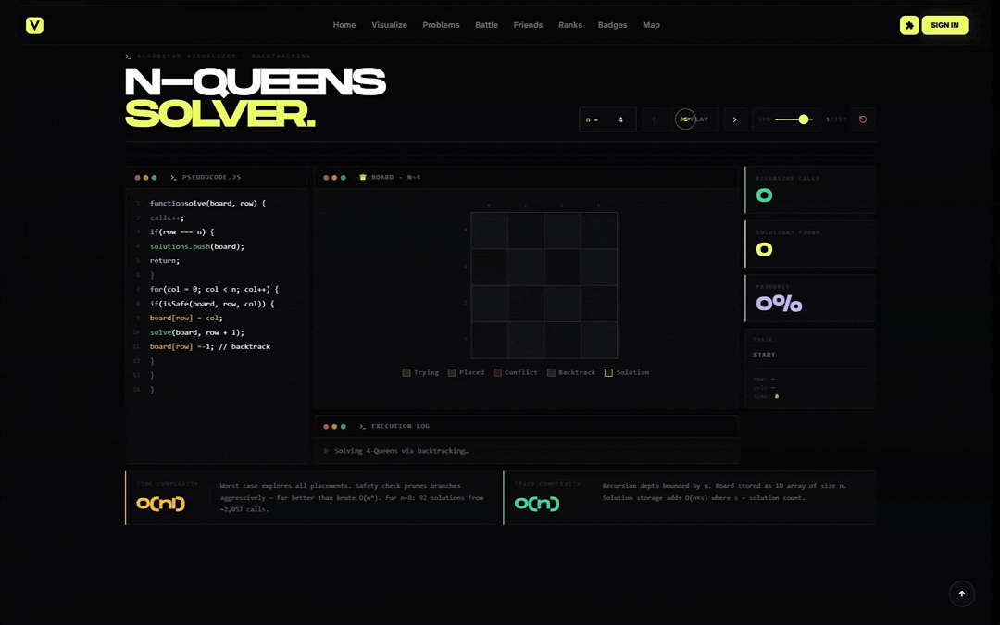

<div align="center">

<!-- Animated title using SVG -->


<br/>

<!-- Badges -->
<p>
  
  
  
</p>

<br/>

> **Vantage** makes Data Structures & Algorithms tangible — through interactive visualizers, gamified progression, and real-time multiplayer coding battles.

<br/>

<!-- Divider -->


</div>

<br/>

## 🎬 N-Queens Visualizer

<div align="center">

<!-- PLACEHOLDER: Replace the path below with your actual N-Queens GIF from /assets -->


<sub><i>N-Queens Backtracking — watch the algorithm place and retract queens in real time</i></sub>

</div>

<br/>


## ✦ Overview

Vantage is an open-source, React-based frontend platform for learning algorithms by **watching them unfold**. Built around a "Terminal Brutalism" aesthetic — high contrast, monospace, purposefully raw — it turns abstract CS concepts into something you can actually see.

The community is invited to **contribute new algorithm visualizers**, improve existing ones, and help build the most comprehensive visual DSA tool in open source.

**What's inside:**
- 🔢 Step-by-step algorithm animation engine
- 🎮 Gamified progression & XP system
- ⚔️ Multiplayer coding battle mode
- 🔍 Unified search across all algorithm categories
- 🧩 Plug-and-play visualizer architecture — easy to extend

<br/>


## 🏗️ Architecture

```
src/
├── App.jsx                 # Main entry point and global layout wrapper
├── index.css               # Global Tailwind utilities and base styles
├── components/             # Reusable, feature-agnostic components
│   ├── animations/         # Heavy canvas-based background animations
│   ├── common/             # Universally used parts (Cursor, Theme, Tooltip)
│   ├── layout/             # High-level layout shells (Navbar, ProtectedRoute)
│   ├── problems/           # Shared problem-related UI (AlgoCards, Table)
│   ├── ui/                 # shadcn UI primitives (cards, buttons, dialogs)
│   └── visualizer/         # The core Algorithm Visualizer engine components
│
├── pages/                  # The actual routed endpoints (Grouped by Feature)
│   ├── achievements/       # /achievements
│   ├── algorithms/         # /<algorithm-topic>/<algorithm-name> (Visualizers)
│   ├── auth/               # /login, /signup
│   ├── battle/             # /battle, /battle/lobby, /battle/result
│   ├── friends/            # /friends
│   ├── group/              # Group battle lobbies and arenas
│   ├── home/               # / (The main landing page)
│   ├── inventory/          # /store/inventory
│   ├── judge/              # The code editor and execution environment
│   ├── leaderboard/        # /leaderboard
│   ├── profile/            # /profile
│   ├── store/              # /store
│   └── topics/             # /visualizers, /<topic-name>
│
├── map/                    # The /map World Map module (uses Three.js)
├── routes/                 # Lazy-loaded route definitions (routes/index.jsx)
├── services/               # API clients (axios fetch calls)
├── stores/                 # Zustand global state (auth, progress, etc.)
├── data/                   # Static data (topic configs, map nodes, etc.)
└── search/                 # Client-side search indices and catalog
```

**Visualizer Flow:**

```
/visualizers  →  /<topic>  →  /<topic>/<algo>
  (hub)          (catalog)     (VisualizerShell + component)
```

<br/>


## ⚡ Quick Start

```bash
# 1. Clone the repository
git clone https://github.com/yourusername/vantage.git
cd reactapp

# 2. Install dependencies
npm install

# 3. Start the development server
npm run dev
```

Open `http://localhost:5173` and start exploring.

<br/>


## 🛠️ Contributing a Visualizer

We actively review PRs and welcome all skill levels. Here's how to add a new algorithm:

### Step 1 — Create the component

Navigate to `src/pages/algorithms/<topic>/` and create your file:

```
src/pages/algorithms/sorting/InsertionSort.jsx
```

### Step 2 — Follow the design system

Vantage uses a "Terminal Brutalism" aesthetic. Your visualizer must conform to it:

| Token | Value | Usage |
|---|---|---|
| Background | `#09090b` / `bg-zinc-950` | Page & panel backgrounds |
| Accent | `#EDFF66` / `text-vantage-yellow` | Highlights, active states |
| Typography | Monospace | All numerical / array data |
| Borders | Sharp, no radius | All containers |

### Step 3 — Implement the stateless frame architecture

The visualizer engine steps through an array of "frames." Each frame is a snapshot of algorithm state:

```jsx
// Each frame = one snapshot of algorithm state
const generateFrames = (array) => {
  const frames = [];
  // ... run your algorithm, push snapshots
  frames.push({ array: [...arr], comparing: [i, j], swapped: false });
  return frames;
};

export default function InsertionSort() {
  // VisualizerShell drives currentFrame via Play/Pause/Step controls
  return <YourVisualization frame={frames[currentFrame]} />;
}
```

### Step 4 — Register the algorithm

Add an entry to `src/data/algorithms.js` so it appears in the hub and search:

```js
{
  id: "insertion-sort",
  title: "Insertion Sort",
  topic: "sorting",
  difficulty: "Easy",
  tags: ["sorting", "comparison", "stable"],
  component: () => import("../pages/algorithms/sorting/InsertionSort"),
}
```

### Step 5 — Submit your PR

```bash
git checkout -b feature/add-insertion-sort
git commit -m "feat: add Insertion Sort visualizer"
git push origin feature/add-insertion-sort
```

Then open a Pull Request against `main`. Include a short screen recording or GIF of your visualizer in action.

<br/>


## 📋 Contribution Guidelines

- ✅ One visualizer per PR — keep changes focused
- ✅ Match the Terminal Brutalism design system exactly
- ✅ Use the stateless frame architecture
- ✅ Include time & space complexity in a comment block at the top
- ✅ Test at multiple array sizes and edge cases (empty, single element, sorted)
- ❌ Do not modify `VisualizerShell` core controls without discussion
- ❌ Do not introduce new global dependencies without prior issue discussion

<br/>


## 📄 License

Released under the [MIT License](LICENSE). You are free to use, modify, and distribute this project.

<br/>

<div align="center">


</div>